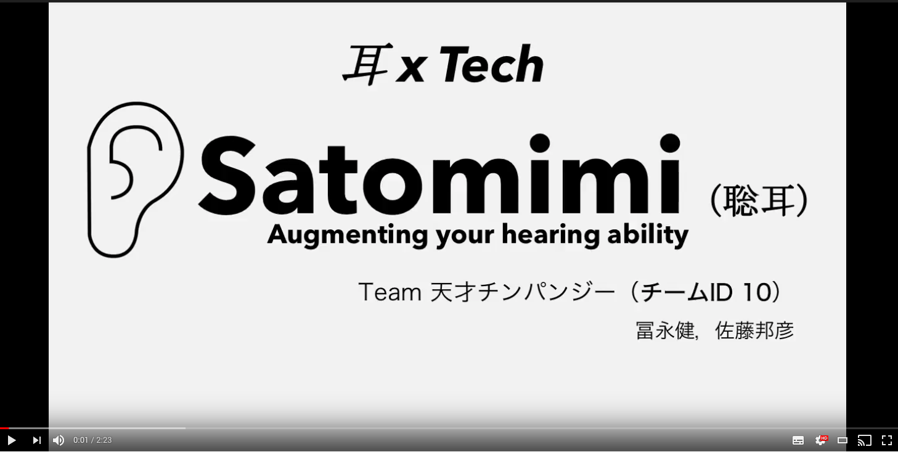
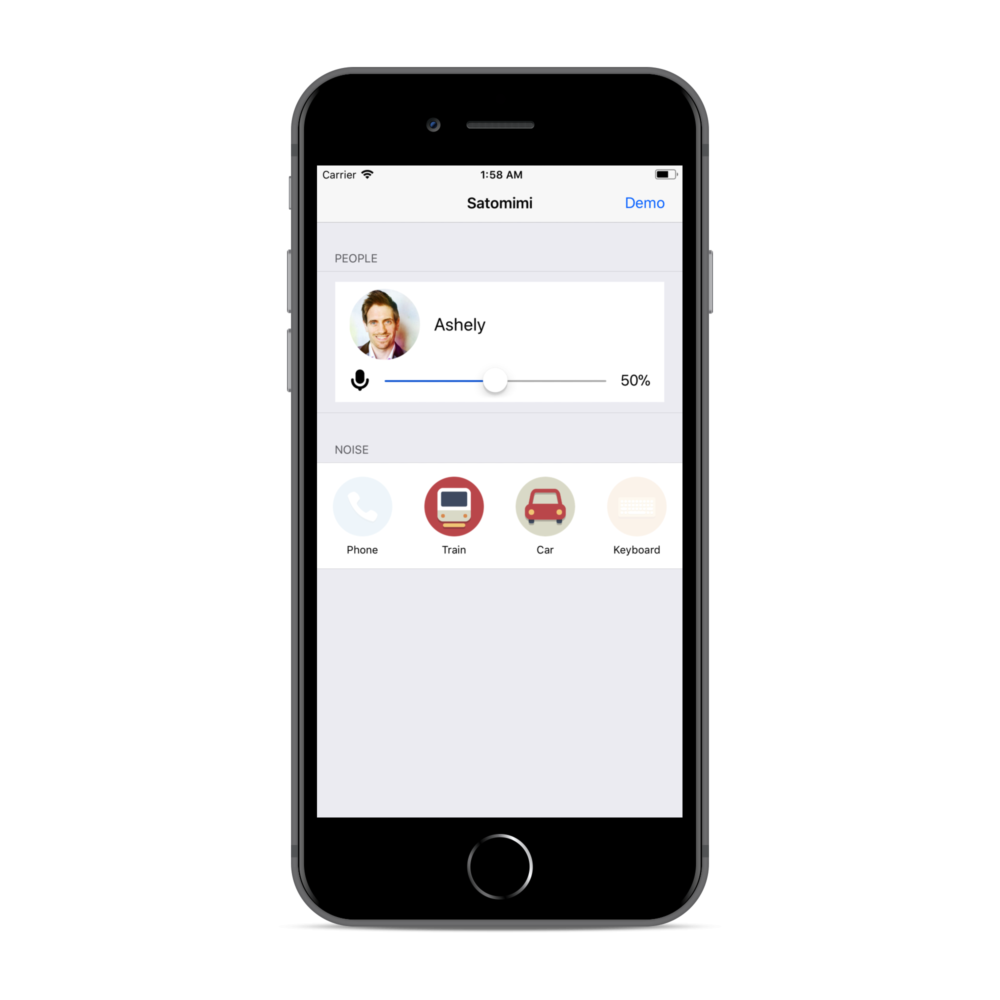

# Satomimi

## Screenshot - iOS Application

## 製品概要
### 耳 × Tech

### 背景（製品開発のきっかけ、課題等）

私たちは、特定の人の声だけを消したいときがあります。例えば，授業中に後ろの席で私語をする人や、電車内で大きな声で喋る人、あるいは口うるさい上司などがそれにあてはまります。

あるいは、私たちは、特定の人の声だけを聞きたいときがあります。街中や飲食店などの人が多い場所では、会話相手の声が聞きづらいときがあります。そのようなときに、会話相手の声だけを聞くことができたら便利です。

そんな人類の「聞きたい」「聞きたくない」のどちらの想いも実現したのが、「Satomimi」です。
特定の人の声だけを消したり、あるいは、抽出したりできます。

### 製品説明（具体的な製品の説明）

特定の人の声だけを消したり、あるいは、抽出したりできます。

### 特徴

#### 1. 聞きたい音だけを聞くことができる。

#### 2. 聞きたくない音を聞かなくすることができる。

#### 3. Deep Learningを駆使し、多様な雑音や他人の声が音源に混在していても、「特徴1,2」の動作をロバストに実現できる。

### 解決出来ること
- うるさい人の声を消すことができます。授業中に私語をする人の声を消して、先生の声だけを聞くことができます。

- 聞きたい人の声だけを聞くことができます。騒音時でも会話相手の声を聞きやすくできます。

- 聴覚障害者の支援ができます。

- 放送禁止用語を言った人の声だけを消すことができます。

- うざい上司の声を消すことができます。

- 好きな人の声だけを聞くことができます。

### 今後の展望

- 現在は音声データを一度サーバーに送信しているが、よりリアルタイム性を高めるために音声処理をスマートフォン上に実装する。

- 特定の人の声だけでなく、特定の「音」（車の走行音やねこの鳴き声）だけを消したり抽出したりできるようにする。

- イヤホン・補聴器への組み込み。

## 開発内容・開発技術

### 活用した技術

#### フレームワーク・ライブラリ・モジュール

##### Web Server
* Flask

##### Deep Learning
* theano-backend Keras
* Python

##### Client（iOS Application）
* Swift
  * AVFoundation
  * APIKit
  * R.swift

##### デバイス
* iPhone

##### API・データ
今回は提供APIを利用しなかったのですが、今後の開発でリアルタイム処理やビデオチャットへの応用として、NTTコミュニケーションズのWebRTCプラットフォーム「SkyWay」の利用を考えています。
また、Satomimiの応用例として、放送禁止用語を言った人の声だけを消すアプリを考えています。放送禁止用語の判定のために、NTTレゾナントのAPIの利用を考えています。

### 独自開発技術（Hack Dayで開発したもの）

#### 2日間に開発した独自の機能・技術

* 雑音や様々な人の声が含まれた音声から、特定の人物の音声だけを抽出するDeep Neural Network（DNN）のコーディングと学習
（-> このDNNは、抽出された人物の音声を元の音声から差し引くことで、その人物の声を消すことにも応用できる。）

* DNN用サーバーの構築

* iOSアプリケーション
  - 完成形のインターフェース
  - 音声の録音/再生機能
  - MPEG4AACからWAVへの変換
  - サーバーを介した音声変換機能
