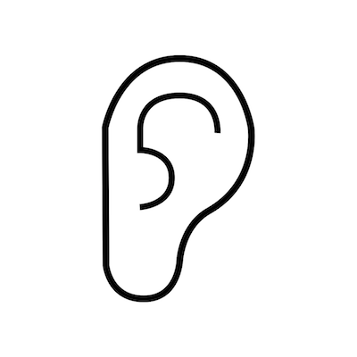

# Satomimi

## Movie

## Screenshot - iOS Application

## 製品概要
### 耳 × Tech

### 背景（製品開発のきっかけ、課題等）

われわれ人類は、特定の人の声だけを消したいときがある。授業中に席の後ろのほうで私語をする人や、電車内で大きな声で喋る人、あるいは口うるさい上司。現実世界から、これらの人の声だけを消したい。
あるいは、われわれ人類は、特定の人の声だけを聞きたいときがある。街中で恋人と一緒にいるときは、周りの雑音を消して恋人との会話を楽しみたい。

そんな人類の「聞きたい」「聞きたくない」のどちらの想いも実現したのが、「Satomimi」。
特定の人の声だけを消したり、あるいは、抽出したりできます。

### 製品説明（具体的な製品の説明）

特定の人の声だけを消したり、あるいは、抽出したりできます。

### 特徴

#### 1. 聞きたい音だけを聞くことができる。

#### 2. 聞きたくない音を聞かなくすることができる。

### 解決出来ること

- 聴覚障害を持つ方が補聴器として利用することで、聞きたい音が雑音に邪魔されることを防ぐ。

- 既存の単なるノイズキャンセリングではなくフィルタリングする音を選択できる。
たとえば、ランニングのときは安全のために車の音をフィルタリングせずに聞く、電車内では車内アナウンスだけは聞くなど。

### 今後の展望

- iPhone内での音声変換の実現
iOS内でモデルから予測を行なうことができるCoreMLというフレームワークを使えばできる。
今回も挑戦しようとしたが、今回生成したモデルが現在CoreMLにサポートされていなかったので断念した。
モデルを対応済みのフレームワークで再学習すれば、iPhoneのマイクから拾った音をSatomimiで変換することができる。

- 騒音分類モデルの構築

- イヤホン・補聴器への組み込み

## 開発内容・開発技術

### 活用した技術

#### フレームワーク・ライブラリ・モジュール

##### Web Server
* Flask

##### Deep Learning
* theano-backend Keras
* Python

##### Client（iOS Application）
* Swift
  * AVFoundation
  * APIKit
  * R.swift

##### デバイス
* iPhone

### 独自開発技術（Hack Dayで開発したもの）

#### 2日間に開発した独自の機能・技術

* 雑音の含まれた音声から、特定の人物の音声を抽出するネットワーク
（-> 元の音声と、抽出された人物の音声の差分を取れば雑音と分離することができる。）

* iOSアプリケーション
  - 完成形のインターフェース
  - 音声の録音/再生機能
  - MPEG4AACからWAVへの変換
  - サーバーを介した音声変換機能
